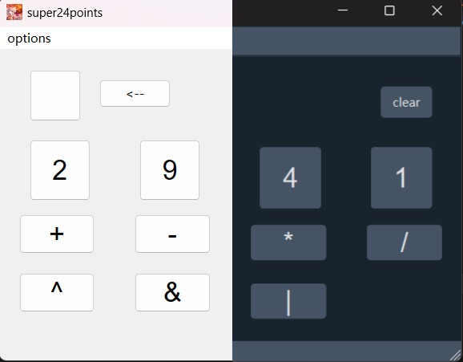

# super24points

超级 24 点，在普通 24 点的基础上扩展了**负数，指数，整除，位运算**。

- easy: 四则运算
- normal: [-10,-1] ∪ [1,10]，四则运算
- hard: [1,10]，四则运算 指数运算^ 整除运算//（向 0 取整）
- lunatic: [1,10]，四则运算 按位异或^ 按位与& 按位或|

支持深色模式。

程序使用 C++20 & Qt6.6.0，使用 [xmake](https://xmake.io/#/zh-cn/) 构建。Release 中仅提供 windows 可执行文件的版本，若需在其他系统运行请自行编译。




## build from source

> Changing the build system to xmake is not so easy, but it worth.([read more](https://absx.pages.dev/coding/Cpp.html#配置-qt-开发环境)) That's my first Qt project using xmake.

1. edit `xmake.lua` and set toolchains
2. build
   ```sh
   xmake && xmake r
   ```

### develop

use `xmake project -k compile_commands` to set lsp.
